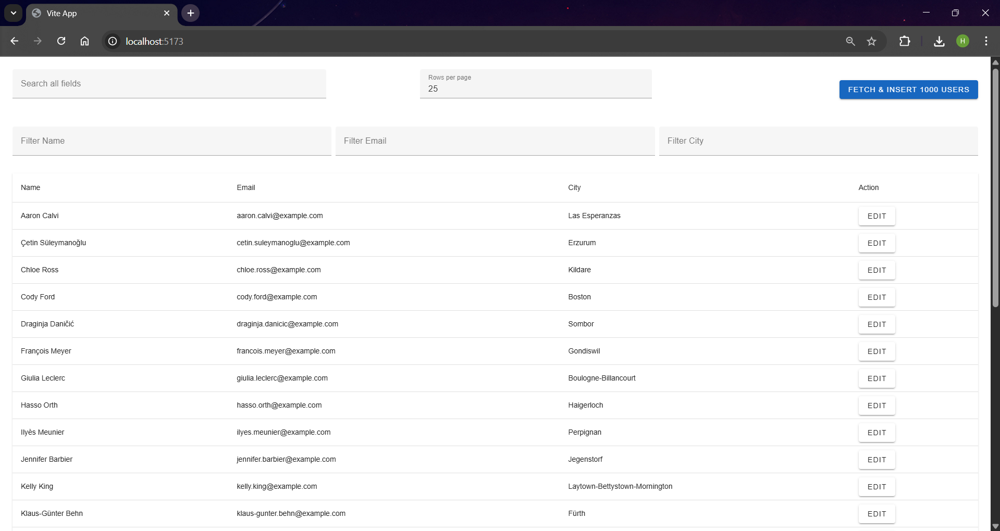
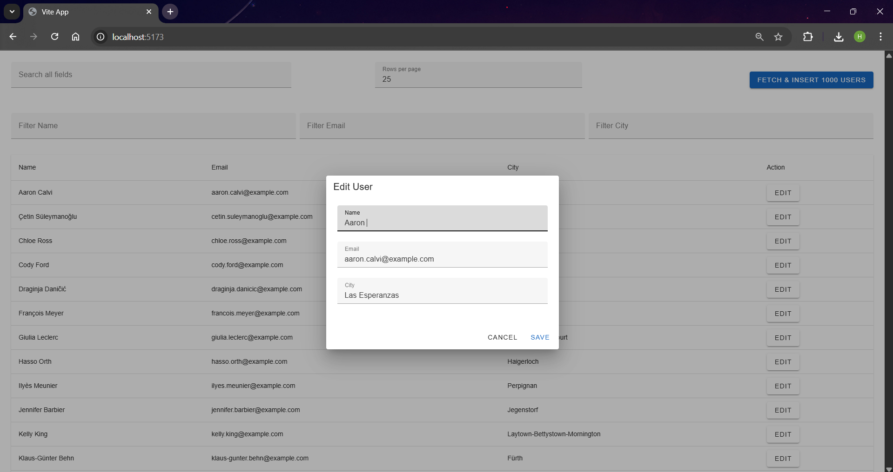
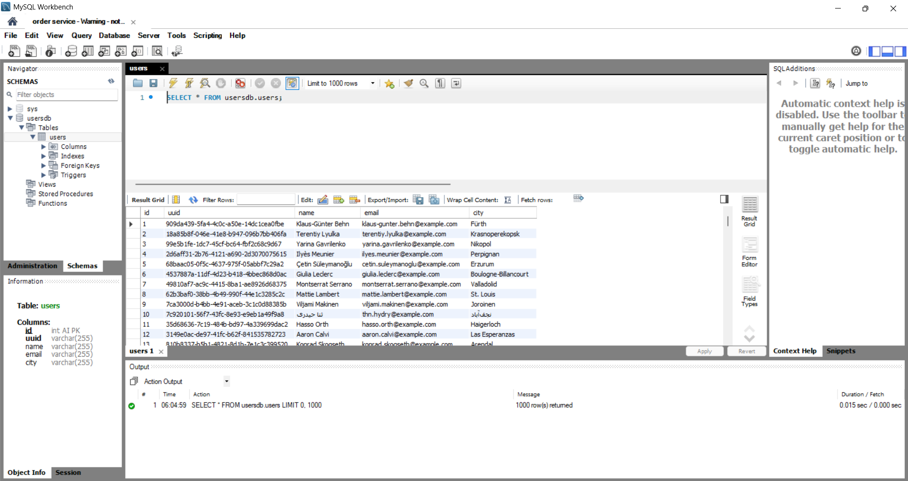
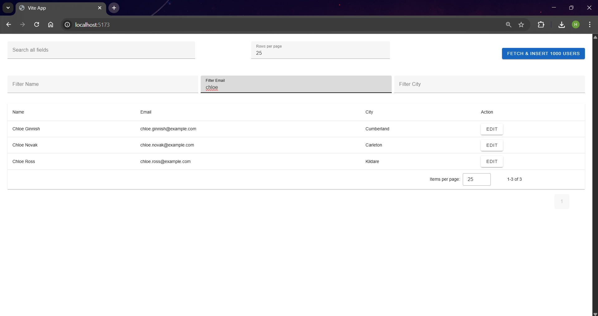
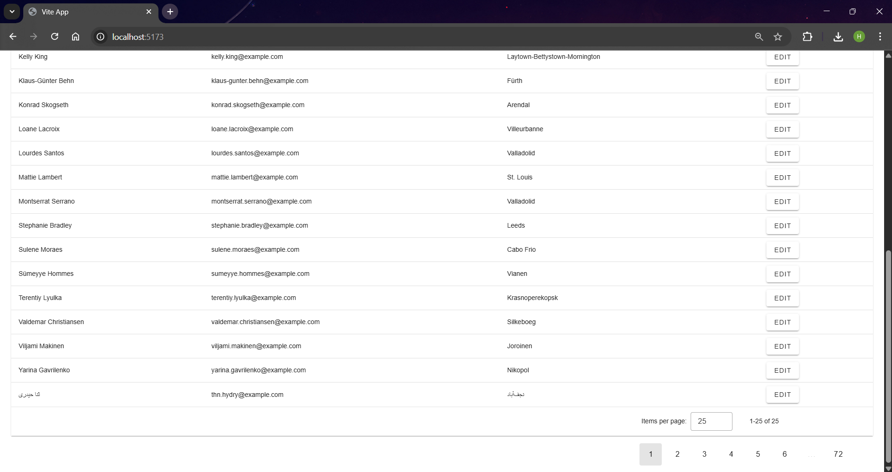

# Fullstack Assignment – Nua Internship

## 🚀 Overview

This repository contains the complete full-stack solution for the **Nua Fullstack Developer Internship Assignment**.  
The stack includes:

- **Vue 3 + Vite + Vuetify 3** frontend
- **Node.js + Express** backend
- **MySQL 8 using Docker**
- **Automatic migrations using Docker entrypoint scripts**
- **Environment-based configuration**

---

## 🧰 Tech Stack

### Frontend

- Vue 3
- Vite
- Vuetify 3
- Axios

### Backend

- Node.js
- Express
- MySQL
- Axios
- dotenv
- cors

### Database

- MySQL 8 (Docker)
- Automatic migrations via `/docker-entrypoint-initdb.d/*.sql`

---

## 🐳 Docker Setup (MySQL with auto migrations)

### `docker-compose.yml`

```yaml
version: "3.8"
services:
  mysql:
    image: mysql:8
    container_name: userdb
    restart: always
    environment:
      MYSQL_ROOT_PASSWORD: root
      MYSQL_DATABASE: usersdb
    ports:
      - "3308:3306"
    volumes:
      - mysql_data:/var/lib/mysql
      - ./backend/migrations:/docker-entrypoint-initdb.d
volumes:
  mysql_data:
```

### How migrations work

Any `.sql` file inside:

```
backend/migrations/*.sql
```

is executed **automatically on first container startup**.

Example migration file:

### `backend/migrations/001_create_users_table.sql`

```sql
CREATE TABLE IF NOT EXISTS users (
  id INT AUTO_INCREMENT PRIMARY KEY,
  uuid VARCHAR(255) UNIQUE NOT NULL,
  name VARCHAR(255),
  email VARCHAR(255),
  city VARCHAR(255)
);
```

---

## 🔑 Environment Setup

### Backend

```bash
cd backend
cp .env.example .env
npm install
npm run dev
```

#### `.env.example`

```
DB_HOST=127.0.0.1
DB_PORT=3308
DB_USER=root
DB_PASSWORD=root
DB_NAME=usersdb
PORT=5000
```

---

### Frontend

```bash
cd frontend
cp .env.example .env
npm install
npm run dev
```

#### `.env.example`

```
VITE_API_BASE_URL=http://localhost:5000/api/users
```

---

## ▶️ Running the Project

### 1️⃣ Start MySQL with migrations

```bash
docker-compose up -d
```

### 2️⃣ Start backend

```bash
cd backend
npm run dev
```

### 3️⃣ Start frontend

```bash
cd frontend
npm run dev
```

### 4️⃣ Populate DB with users

```
POST http://localhost:5000/api/users/fetch
```

## 🖼️ Screenshots

### 📍 Users Table



### 📍 Edit Dialog



### 📍 MySQL Table



### 📍 Filter Feature

## 

### 📍 Pagination Feature

## 

---

## 📡 API Endpoints

### **POST /api/users/fetch**

Fetches 1000 RandomUser profiles & stores them in DB.

### **GET /api/users**

Returns all users.

### **PUT /api/users/:uuid**

Updates:

- name
- email
- city

---

## 📁 Project Structure

```
root
│── backend
│   ├── src
│   │   ├── config/
│   │   ├── controllers/
│   │   ├── routes/
│   │   ├── services/
|   |   ├── utils/
│   │   ├── app.js
│   ├── migrations/ (auto-run SQL migrations)
│   ├── package.json
│   ├── .env.example
|   └── docker-compose.yml
│
│── frontend
│   ├── src/
│   │   ├── components/
│   │   ├── views/
│   │   ├── router/
│   │   ├── App.vue
│   │   └── main.js
│   ├── .env.example
│   ├── vite.config.js
│   ├── package.json

```

---
